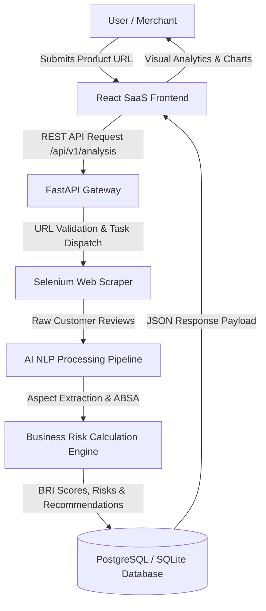

# RiskAI — AI-Powered Business Risk Analysis & Recommendation System

[](https://fastapi.tiangolo.com/)
[](https://reactjs.org/)
[](https://pytorch.org/)
[](https://tailwindcss.com/)
[](#-license--disclaimer)

---

## 📌 Executive Summary

**RiskAI** is an advanced enterprise business intelligence and automated risk management platform developed for online sellers and e-commerce merchants. By harnessing Natural Language Processing (NLP), Aspect-Based Sentiment Analysis (ABSA), and web scraping technology, the platform evaluates customer feedback across major e-commerce marketplaces (such as Daraz) to compute an actionable **Business Risk Index (BRI)**.

Instead of relying solely on generic rating averages, RiskAI identifies underlying product flaws, delivery bottlenecks, and merchant trust deficits, supplying business owners with data-backed mitigation strategies and verbatim customer evidence.

---

## 🚀 Key Features

* **🤖 AI-Driven Aspect-Based Sentiment Analysis**: Deep neural NLP models extract fine-grained sentiments across product dimensions (Quality, Delivery, Packaging, Pricing, and Merchant Trust).
* **📊 Business Risk Index (BRI) Engine**: Quantitative risk score calculation ($0 - 100$) categorized into **Very Low**, **Low**, **Medium**, **High**, and **Critical** risk levels.
* **🕷️ Automated Marketplace Web Scraping**: Seamless review ingestion using automated Selenium web drivers.
* **💡 Strategic AI Recommendations & Evidence Extraction**: Automated action plans paired with contextual customer quotes for immediate operational improvements.
* **📈 Executive SaaS Dashboard & Data Visualizations**: Modern interactive analytics powered by React, Tailwind CSS, and Recharts.
* **🔒 Secure Multi-Tenant Authentication**: JWT-secured endpoints, password hashing via bcrypt, and OTP password recovery workflow.

---

## 🏗️ System Architecture & Workflow



---

## 💻 Tech Stack

### Backend & API Core
* **Framework**: [FastAPI](https://fastapi.tiangolo.com/) (Async Python Framework)
* **Data Validation & Settings**: Pydantic v2
* **ORM & Database**: SQLAlchemy 2.0 & Alembic (Migrations)
* **Authentication**: PyJWT & Passlib (Bcrypt)

### AI, NLP & Machine Learning
* **Deep Learning & Transformers**: PyTorch, HuggingFace `transformers`, `sinling`
* **Data Science & Processing**: Pandas, NumPy, Scikit-Learn
* **Scraping Engine**: Selenium Webdriver

### Frontend SaaS Interface
* **Core & Build Tool**: React 18, Vite
* **Routing & State**: React Router v6, Context API (`AuthContext`)
* **Styling & UI Components**: Tailwind CSS v4, Material-UI (MUI), Lucide Icons
* **Data Visualizations**: Recharts, Framer Motion

---

## 📁 Repository Structure

```
├── app/                        # FastAPI Backend Application Root
│   ├── api/                    # Routers, Schemas & Dependencies
│   │   ├── dependencies/       # Auth & Service Injections
│   │   ├── routers/            # Endpoint Routers (auth, analysis, history, profile)
│   │   └── schemas/            # Pydantic Models & API Contracts
│   ├── config/                 # Environment & System Configurations
│   ├── database/               # Database Connection & Sessions
│   ├── models/                 # SQLAlchemy Database Entities
│   ├── services/               # Core Business Logic & AI Orchestrators
│   └── main.py                 # FastAPI Application Entry Point
├── core/                       # AI Core Models & Training Scripts
├── frontend/                   # React + Vite SaaS Client Application
│   ├── src/
│   │   ├── api/                # Axios Configuration & API Endpoint Mappers
│   │   ├── components/         # Reusable Auth, Landing & Common UI Components
│   │   ├── context/            # AuthContext Provider
│   │   ├── pages/              # SaaS Views (Dashboard, Analyze, Results, History)
│   │   └── utils/              # Error Parsers & Formatters
│   ├── index.html              # Single Page Application Entry
│   └── vite.config.js          # Vite Bundler Configuration
├── database/                   # Migrations & Database Scripts
├── requirements.txt            # Python Dependencies Specification
└── README.md                   # System Documentation
```

---

## ⚡ Quick Start Guide

### Prerequisites

Ensure you have the following software installed locally:
* **Python**: `3.10` or higher
* **Node.js**: `v18.0.0` or higher (`npm` included)
* **Database**: PostgreSQL (or SQLite for local evaluation)
* **Browser Driver**: Google Chrome (installed locally for Selenium scraping)

---

### 1. Backend Setup

1. **Clone the Repository**:
   ```bash
   git clone https://github.com/Shakir5665/AI-Powered-Business-Risk-Analysis-and-Recommendation-System-for-Online-Businesses.git
   cd AI-Powered-Business-Risk-Analysis-and-Recommendation-System-for-Online-Businesses
   ```

2. **Create & Activate Virtual Environment**:
   ```bash
   python -m venv venv
   # On Windows:
   .\venv\Scripts\activate
   # On macOS/Linux:
   source venv/bin/activate
   ```

3. **Install Dependencies**:
   ```bash
   pip install -r requirements.txt
   ```

4. **Configure Environment Variables**:
   Create a `.env` file in the root directory (or use default configuration):
   ```env
   APP_NAME="RiskAI Backend"
   DATABASE_URL="sqlite:///./risk_analysis.db"
   JWT_SECRET_KEY="your-super-secret-key-change-in-production"
   DEBUG=True
   ```

5. **Run Migrations & Start FastAPI Backend**:
   ```bash
   alembic upgrade head
   python -m app.main
   ```
   * The API server will start at `http://localhost:8000`.
   * Swagger Documentation is available at `http://localhost:8000/docs`.

---

### 2. Frontend Setup

1. **Navigate to Frontend Directory**:
   ```bash
   cd frontend
   ```

2. **Install Frontend Dependencies**:
   ```bash
   npm install
   ```

3. **Configure Environment File**:
   Create a `.env` file inside `frontend/`:
   ```env
   VITE_API_URL=http://localhost:8000/api
   ```

4. **Launch Vite Development Server**:
   ```bash
   npm run dev
   ```
   * The React application will open at `http://localhost:5173`.

---

## 📡 API Endpoints Overview

| Module | Method | Endpoint | Description |
| :--- | :--- | :--- | :--- |
| **Auth** | `POST` | `/api/v1/auth/register` | User Account Registration |
| **Auth** | `POST` | `/api/v1/auth/login` | Authenticate User & Issue JWT Token |
| **Auth** | `POST` | `/api/v1/auth/forgot-password` | Request 6-digit Password Reset OTP |
| **Auth** | `POST` | `/api/v1/auth/reset-password` | Verify OTP and Reset Password |
| **Analysis** | `POST` | `/api/v1/analysis/check-product`| Extract Product Preview Data |
| **Analysis** | `POST` | `/api/v1/analysis/start` | Trigger Async Guided Scraping & AI Processing Job |
| **Analysis** | `GET` | `/api/v1/analysis/status/{id}` | Live Status & Progress Polling |
| **Analysis** | `GET` | `/api/v1/analysis/result/{id}` | Fetch Complete Business Risk Analysis Results |
| **History** | `GET` | `/api/v1/history` | Paginated User Analysis History |
| **Profile** | `GET` | `/api/v1/profile` | Retrieve Current Authenticated Profile |

---

## 🎓 Academic Context

This repository represents the official codebase for a **University Final Year Research Project**. The platform demonstrates the application of modern artificial intelligence, aspect-based sentiment analysis, and full-stack software architecture to solve real-world e-commerce risk evaluation challenges.

---

## 📄 License & Disclaimer

This project is licensed under the research and academics guidelines of the university. The code provided is for educational and research evaluation purposes.
